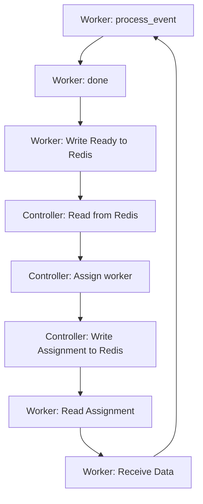

# High Rate Scans

There are a few critial roundtrips which can limit the rate of events dranspose can process.

Most of these bottlenecks are mitigated by clever triggermap and payload design.

## Worker assignment

The most complex bottleneck stems from the dynamic worker assignment.

Below is a diagram of the path required for every worker for every event it processes:

A basic echo through two redis streams on a local redis achieves around 1200 roundtrips per second (c.f. test_redis_rate).
To get past this, we commonly use multiple workers which are then assigned in an interleaved way.

To scale more efficiently, it is possible to assign whole batches of events to a single worker.
This means, the trigger map should assign multiple consecutive events to the same worker.
This creates a batch assignment and sends a single, larger message through redis.

## Worker to Reducer

Another rate limit stems from the invocation of `process_result` in the reducer. It is usually limited to around 1000 invocations per second and considerably less if the payload performs complex computation. The `timer` function can be used to minimize the computation load on `process_result`.
A good way to prevent this bottleneck is to return `None` in `process_event` at the worker as often as possible and return a batch of results from the worker at a lower rate.
Only non-`None` values are sent to the reducer and are processed. `None` outputs from the worker mark the event as done.

## Single Ingester ZMQ

Independent of the redis, controller and python event loop, the zmq library enforces some hard limits how many frames it can receive per second.
The single ZMQ ingester in rust may reach this limit. To achieve higher rates, more than one zmq PULL sockets need to connect to the upstream source.
