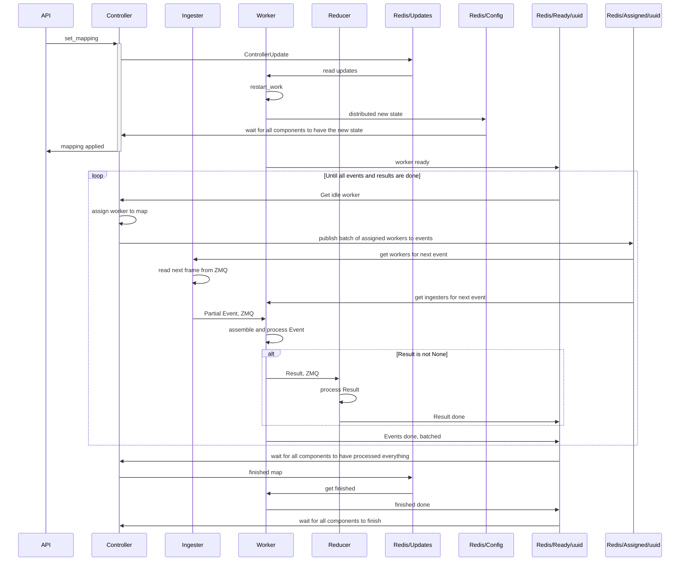

# Controller

## Scan Sequence

```mermaid
sequenceDiagram
    participant API
    participant Controller
    participant Ingester
    participant Worker
    participant Reducer
    API ->>+ Controller: set_mapping
    Controller ->> Redis/Updates: ControllerUpdate

    Redis/Updates ->> Worker: read updates
    Worker->>Worker: restart_work
    Worker ->> Redis/Config: distributed new state
    Redis/Config ->> Controller: wait for all components to have the new state
    Controller ->>- API: mapping applied
    Worker ->> Redis/Ready/uuid: worker ready

    loop Until all events and results are done
        Redis/Ready/uuid ->> Controller: Get idle worker
        Controller ->> Controller: assign worker to map
        Controller ->> Redis/Assigned/uuid: publish batch of assigned workers to events
        Redis/Assigned/uuid ->> Ingester: get workers for next event
        Ingester ->> Ingester: read next frame from ZMQ
        Redis/Assigned/uuid ->> Worker: get ingesters for next event
        Ingester ->> Worker: Partial Event, ZMQ
        Worker ->> Worker: assemble and process Event
        alt Result is not None
            Worker ->> Reducer: Result, ZMQ
            Reducer ->> Reducer: process Result
            Reducer ->> Redis/Ready/uuid: Result done
        end
        Worker ->> Redis/Ready/uuid: Events done, batched
    end
    Redis/Ready/uuid ->> Controller: wait for all components to have processed everything
    Controller ->> Redis/Updates: finished map
    Redis/Updates ->> Worker: get finished
    Worker ->> Redis/Ready/uuid: finished done
    Redis/Ready/uuid ->> Controller: wait for all components to finish
    
```