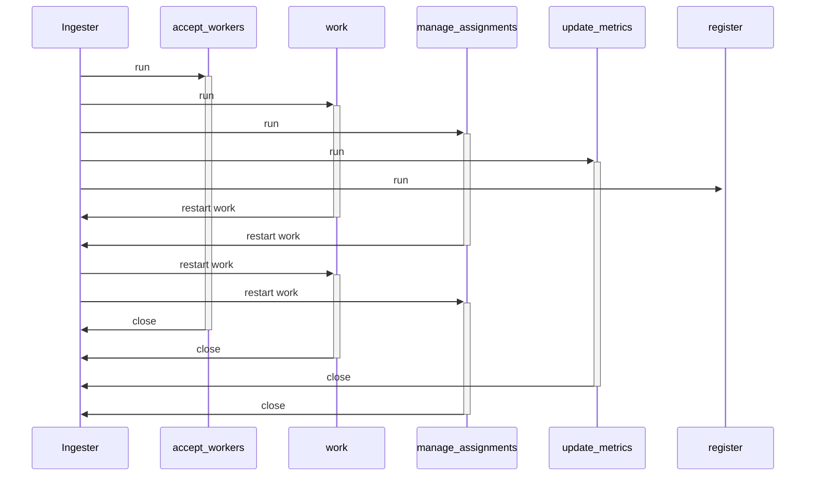

#Ingester

## Sequence Diagram

```mermaid
sequenceDiagram
    Ingester ->>+ accept_workers: run
    Ingester ->>+ work: run
    Ingester ->>+ manage_assignments: run
    Ingester ->>+ update_metrics: run
    Ingester ->>+ register: run

    
    work ->>- Ingester: restart work
    manage_assignments ->>- Ingester: restart work
    Ingester ->>+ work: restart work
    Ingester ->>+ manage_assignments: restart work
    
    accept_workers ->>- Ingester: close
    work ->>- Ingester: close
    update_metrics ->>- Ingester: close
    manage_assignments ->>- Ingester: close
    
```

::: dranspose.ingester