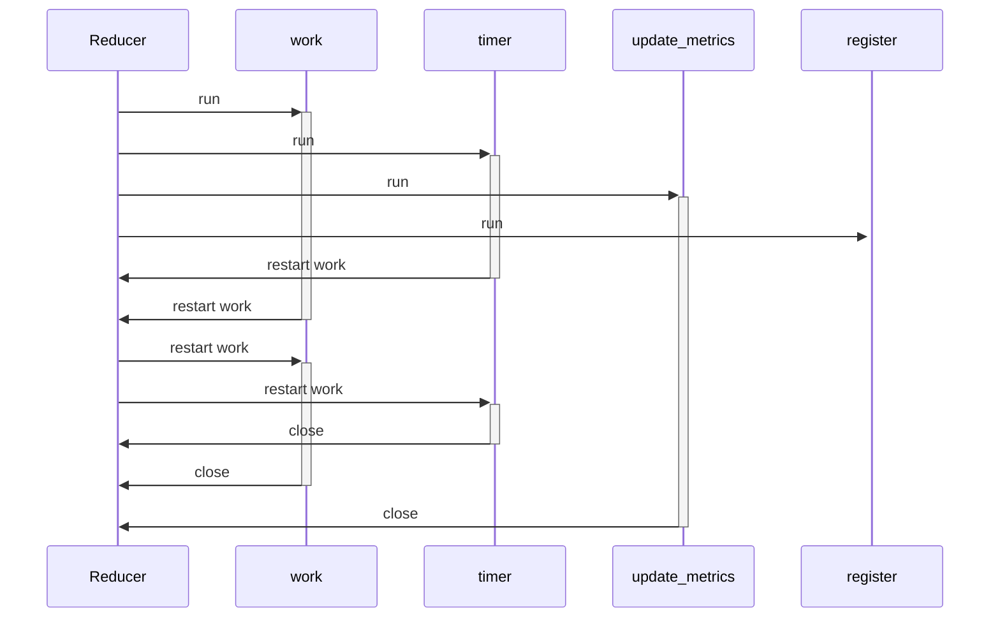

# Reducer

## Sequence Diagram
The reducer is quite simple as it has a `work` task and a `timer` task for periodic callbacks.
Both get restarted on `restart_work` and the `update` metrics and `register` run until the end.

::: dranspose.reducer