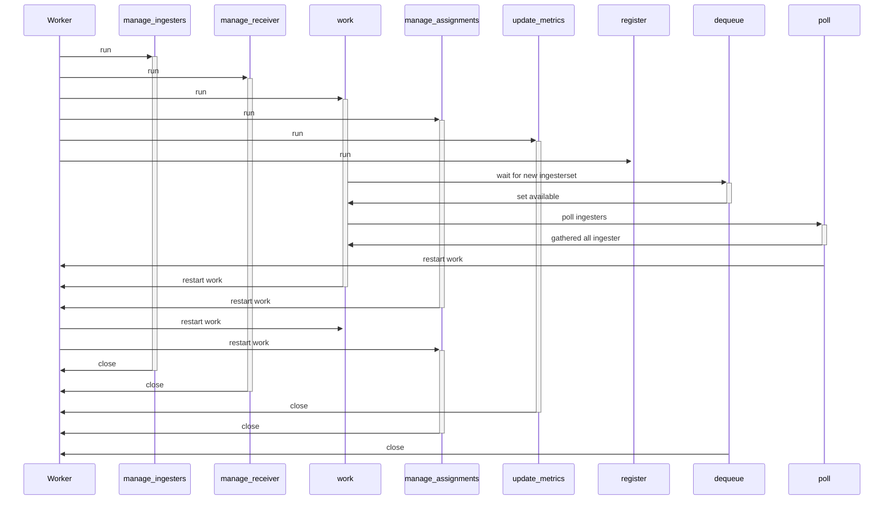
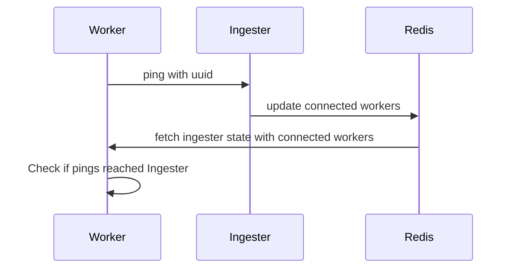

# Worker

## Sequence Diagram
The worker runs many concurrent coroutines to achieve all its tasks.

On `run` it starts most of the coroutines.
`restart_work` first cancels the work relevant ones and then restarts them cleanly.
The `work` coroutine itself uses a `dequeue` and `poll` coroutine to explicitly wait for new assignments or data from ingesters.
This is required to achieve a clean `restart_work` and cancel this waiting.
`close` cleans up all open coroutines.

## Worker Ingester Ping Sequence

::: dranspose.worker

